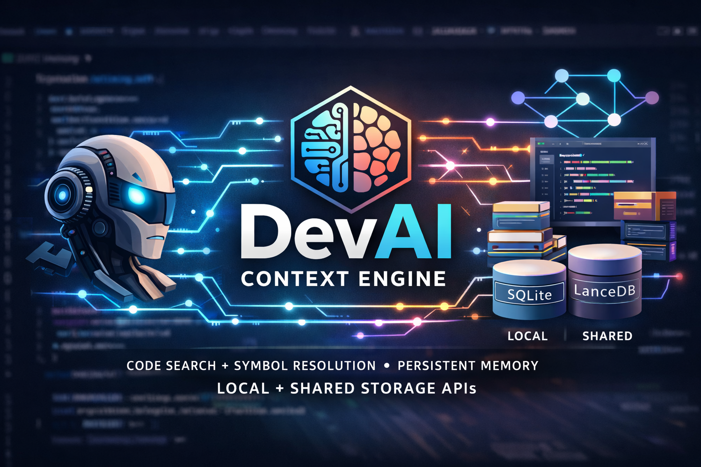

<p align="center">
  
</p>

<h1 align="center">DevAI</h1>

<p align="center">
  <strong>AI Code Intelligence Engine</strong><br/>
  Hybrid Go + Python. Single binary. Git-aware.
</p>

> **Warning**
> **Alpha — Active Development.** DevAI is under heavy development. APIs, CLI flags, and storage formats may change without notice. Expect rough edges. See [Project Status](#project-status) for what works and what does not.

---

[Quick Start](#quick-start) &#8226; [Install](#install) &#8226; [Project Status](#project-status) &#8226; [How It Works](#how-it-works) &#8226; [MCP Tools](#mcp-tools) &#8226; [Agent Setup](#agent-setup) &#8226; [CLI Reference](#cli-reference) &#8226; [Configuration](#configuration) &#8226; [Full Docs](#documentation)

---

Your AI coding agent has no idea what your codebase looks like. It reads files one at a time, guesses at structure, and forgets everything between sessions. DevAI gives it **semantic understanding** — search by meaning, trace call graphs, resolve symbols, and remember decisions across sessions.

One binary, one state directory, 14 MCP tools.

## Install

The install script downloads a precompiled Go binary and a portable Python runtime. No Go or Python required on your machine.

```bash
# Linux / macOS
curl -fsSL https://raw.githubusercontent.com/snaven10/devai-context-engine/main/scripts/install.sh | bash

# Windows (PowerShell)
irm https://raw.githubusercontent.com/snaven10/devai-context-engine/main/scripts/install.ps1 | iex
```

**Install script flags:**

| Flag | Description |
|------|-------------|
| `--gpu` / `-Gpu` | Install PyTorch with CUDA support (default: CPU-only) |
| `--version TAG` / `-Version TAG` | Install a specific release version (default: latest) |
| `--uninstall` / `-Uninstall` | Remove DevAI and all its files |

See [Introduction](docs/01-introduction.md) for detailed setup, manual install from source, and configuration.

```
  AI Assistant ──MCP──▶ DevAI CLI (Go)
                           │
                      JSON-RPC stdio
                           │
                     ML Service (Python)
                      │       │       │
                  ┌───┘       │       └───┐
                  ▼           ▼           ▼
              LanceDB     SQLite      SQLite
              vectors     graphs      memory
```

## Project Status

> **Alpha** — this is a working prototype, not a production release.

### Working Features

| Feature | Notes |
|---------|-------|
| Local vector indexing (LanceDB) | Default storage, works offline |
| Semantic code search | Natural language queries against indexed code |
| AST-aware chunking (tree-sitter) | 25+ languages, 4 chunk levels |
| Symbol reference tracking | Cross-repo call graph and import graph |
| Git-aware incremental indexing | Only processes changed files via `git diff` |
| Branch overlay and deduplication | Feature branch changes take priority over main |
| Persistent memory (SQLite) | Decisions, patterns, bugs with dedup and topic key upserts |
| MCP server integration | Works with Claude Code, Cursor, Windsurf, any MCP client |
| TUI dashboard | 9 screens for browsing repos, search, memory, history |
| Shared storage mode (Qdrant) | Team-wide code search via remote Qdrant |
| Hybrid storage mode | Local + shared with graceful degradation |
| Push/pull/sync index commands | Bidirectional sync between local and Qdrant |
| Cross-platform install scripts | Linux, macOS (bash), Windows (PowerShell) |

### Known Issues / Not Yet Implemented

| Issue | Details |
|-------|---------|
| GPU support in install scripts | `--gpu` flag exists but CUDA install path is untested |
| Memory sharing via Qdrant | Not implemented — memories are SQLite local only, not shared across machines |
| Windows support | Install script exists but is untested on real Windows machines |
| Large venv size | ~1.5 GB for CPU-only PyTorch — no slim install option yet |
| docker-compose.yml | Only has Qdrant service, no full-stack compose with DevAI service |
| gRPC transport | Proto definitions exist but are not used — JSON-RPC over stdio is the only transport |
| OpenAI / Voyage embedding providers | Code exists but integration testing is minimal |
| PHP tree-sitter parser | Not yet bundled — PHP files are indexed as raw text without AST parsing |

---

## Quick Start

```bash
# 1. Build (from source — see Install section above for the easier path)
make build

# 2. Initialize a repository
devai init /path/to/your/repo --name "My Project"

# 3. Index it
cd /path/to/your/repo
devai index

# 4. Configure as MCP server (for Claude Code, Cursor, etc.)
devai server configure --all

# 5. Search
devai search "authentication middleware" --limit 10

# 6. Start MCP server for your AI assistant
devai server mcp
```

That's it. Your AI agent can now search, read symbols, trace references, and build context automatically.

---

## Installation

### From Source (recommended)

> **Prerequisites**: Go 1.24+, Python 3.11+

```bash
git clone <repo-url> devai
cd devai
make build
```

This builds the Go binary (`./devai`) and installs the Python ML package into a virtual environment.

### Build Individually

```bash
make build-go       # Go binary only
make build-ml       # Python ML service only
make install        # Install to $GOPATH/bin
```

### Docker

```bash
make docker              # Build image as devai:latest
docker-compose up -d     # Start DevAI + Qdrant
```

---

## How It Works

### The Problem

AI agents work with code through a keyhole — they read individual files, grep for strings, and have no memory of what they've already seen. They can't answer "where is this function used?" or "what changed on this branch?" without manual file-by-file exploration.

### The Solution

DevAI indexes your entire codebase at the AST level, builds semantic embeddings, and stores call graphs, import relationships, and symbol tables. When your AI agent needs context, it asks DevAI instead of guessing.

### The Pipeline

```
git diff → detect changes → parse (tree-sitter) → extract symbols
    → chunk (AST-aware) → embed (sentence-transformers) → store
```

**Indexing is incremental.** DevAI computes the `git diff` between the last indexed commit and HEAD, processes only what changed, and tracks state per repo/branch. If the embedding model changes, it forces a full reindex automatically.

### Semantic Chunking

Code is split **respecting AST structure** — never mid-symbol:

```
File (imports + symbol list)
  └─ Class (signature + fields)
      ├─ Method 1 (single chunk if small)
      ├─ Method 2 (split at blocks if large)
      └─ ...
  └─ Top-level Function
```

Each chunk includes breadcrumb headers (`file > class > method`) so the AI always knows where it is.

### Branch Overlay

DevAI is fully **branch-aware**:

1. Searches the active branch first (highest priority)
2. Falls back to the merge-base with main
3. Deduplicates results by file, keeping the most specific version
4. Filters tombstones (files deleted in higher-priority branches)

Your feature branch changes always take precedence, with main as the fallback.

### Persistent Memory

Every `remember` call stores structured memories (decisions, patterns, bugs) with:

- **Topic key upserts** — same topic_key updates the existing entry
- **Deduplication** — normalized content hash + 15-min window prevents noise
- **Revision tracking** — counts how many times a memory has been updated
- **Hybrid search** — semantic similarity + metadata filtering

---

## Supported Languages

DevAI uses **tree-sitter** for AST parsing across 25+ languages:

| Full AST Parsing | Raw Text (no AST) |
|---|---|
| Python, JavaScript, TypeScript, Go, Java, Rust, C, C++, Ruby, PHP, Kotlin, Swift, Scala, Dart, C#, Lua, Zig, Elixir | HTML, CSS, SCSS, Sass, Less, JSON, YAML, XML, Markdown, SQL, GraphQL, Protobuf |

---

## MCP Tools

When running as an MCP server (`devai server mcp`), DevAI exposes 14 tools:

### Search & Read

| Tool | Description |
|------|-------------|
| `search` | Semantic search with repo/branch/language filters |
| `read_file` | Read file contents with optional line range |
| `read_symbol` | Get symbol definition, code, and documentation |
| `get_references` | Find all usages of a symbol |
| `build_context` | Auto-assemble AI-ready context with memory enrichment |

### Indexing & Status

| Tool | Description |
|------|-------------|
| `index_repo` | Trigger indexing (incremental or full) |
| `index_status` | Per-branch index freshness and statistics |
| `get_branch_context` | Current branch info and index stats |
| `switch_context` | Switch active repo/branch |
| `get_session_history` | Recent tool calls and events |

### Memory

| Tool | Description |
|------|-------------|
| `remember` | Save structured memory (decisions, patterns, bugs) |
| `recall` | Search memories with hybrid semantic + metadata search |
| `memory_context` | Get recent memories for fast context recovery |
| `memory_stats` | Aggregate memory statistics |

---

## Agent Setup

### Automatic (recommended)

```bash
devai server configure --all
```

This writes MCP server config to Claude Code and Cursor, sets env vars from your project config, and generates `.devai/AGENT.md` with tool usage instructions.

**Flags:** `--claude`, `--cursor`, `--all` (default), `--show` (preview), `--remove`

### Manual

#### Claude Code

Add to `~/.claude/settings.json`:

```json
{
  "mcpServers": {
    "devai": {
      "type": "stdio",
      "command": "/path/to/devai",
      "args": ["server", "mcp"],
      "env": {
        "DEVAI_STATE_DIR": "/path/to/repo/.devai/state"
      }
    }
  }
}
```

#### Cursor / Windsurf / Any MCP Client

Add to `~/.cursor/mcp.json` (same structure). DevAI communicates over **stdio** using the standard MCP protocol — any compliant client can connect.

#### VS Code (Continue / Cline)

Add to your MCP settings in the extension configuration. Same command, same args.

> **Note**: Make sure the `devai` binary is in your PATH or use an absolute path. Restart your AI client after configuring.

---

## Terminal UI

```bash
devai tui
```

The TUI provides 9 screens for browsing and managing your indexed repositories:

- **Dashboard** — overview of indexed repos, version info, update notifications
- **Search Code** — semantic search with vim-key navigation
- **Repositories** — browse repos with stats
- **Branches** — per-branch indexing status
- **Memory** — search and browse persistent memories
- **Session History** — tool call history and timings
- **Index Repository** — trigger indexing on new repos
- **Detail View** — full code snippets with line numbers

The TUI automatically checks for new versions on startup and displays a notification in the header if an update is available.

**Navigation**: `j`/`k` or arrow keys, `Enter` to select, `q` to quit, `b` for back.

---

## CLI Reference

```
devai init [path]           Initialize DevAI in a repository
devai index                 Index current repo (incremental by default)
devai search <query>        Semantic search across indexed code
devai watch [path]          Watch for file changes and auto-index
devai tui                   Open interactive terminal UI
devai server start          Start the Python ML service
devai server status         Check ML service health
devai server mcp            Start MCP server (stdio)
devai server configure      Configure DevAI as MCP server in AI clients
devai status                Show ML service health and model info
devai model list            List available embedding models with cache status
devai model update          Update embedding model from HuggingFace Hub
devai model info            Show current model details
devai upgrade               Upgrade devai to the latest version
devai upgrade --check       Check for updates without installing
devai hooks install         Install git post-commit hook
devai hooks uninstall       Remove auto-index hook

Global flags:
  --config FILE             Path to config file (default: auto-detect .devai/config.yaml)
  --verbose, -v             Enable verbose output
```

---

## Configuration

### Project Config (`.devai/config.yaml`)

Auto-generated by `devai init`:

```yaml
project:
  name: my-repo
  path: /full/path/to/repo

state_dir: /full/path/to/repo/.devai/state

embeddings:
  provider: local
  model: minilm-l6
  # offline: auto  # auto | true | false

storage:
  mode: local

indexing:
  exclude:
    - "node_modules/**"
    - "vendor/**"
    - ".git/**"
    - "__pycache__/**"
    - "dist/**"
    - "build/**"
    - "*.min.js"
    - "*.lock"
```

**Key fields:**

| Field | Description |
|-------|-------------|
| `state_dir` | Where to store index data (vectors, graphs, memories). Each project can have its own isolated index. |
| `embeddings.offline` | `auto` (default) uses cached model without HF Hub check for fast startup. `true` always offline. `false` always checks for updates. |

### Environment Variables

| Variable | Description | Default |
|----------|-------------|---------|
| `DEVAI_STATE_DIR` | Override state directory | `.devai/state/` |
| `DEVAI_PYTHON` | Python binary path | Auto-detected |
| `DEVAI_ML_MODEL` | Embedding model | `minilm-l6` |
| `DEVAI_STORAGE_MODE` | `local`, `shared`, or `hybrid` | `local` |
| `DEVAI_EMBEDDINGS_OFFLINE` | Override offline mode for model loading | `auto` |
| `DEVAI_API_TOKEN` | Token for shared mode | — |

### Embedding Models

Available models (use `devai model list` to see cache status):

| Key | Model | Dimension | Notes |
|-----|-------|-----------|-------|
| `minilm-l6` | all-MiniLM-L6-v2 | 384 | Default. Fast, lightweight. |
| `minilm-l12` | all-MiniLM-L12-v2 | 384 | Better quality, slightly slower. |
| `bge-small` | BAAI/bge-small-en-v1.5 | 384 | Good for English code. |
| `bge-base` | BAAI/bge-base-en-v1.5 | 768 | Best quality, 2x dimension. |

To update the model: `devai model update`

### Embedding Providers

| Provider | Config Value | Notes |
|----------|-------------|-------|
| Sentence Transformers | `local` | Default. No API key needed. |
| OpenAI | `openai` | Requires `OPENAI_API_KEY` |
| Voyage AI | `voyage` | Requires `VOYAGE_API_KEY` |
| Custom HTTP | `custom` | Any endpoint returning vectors |

---

## Storage

All state lives in `.devai/state/` inside the indexed repository:

```
.devai/
├── config.yaml           # Project configuration
└── state/
    ├── vectors/          # LanceDB (embeddings + metadata)
    ├── index.db          # SQLite (graphs, memories, index state)
    └── ml-service.pid    # PID file (background mode)
```

| Store | Backend | Purpose |
|-------|---------|---------|
| Vector Store | LanceDB | Code embeddings with metadata filtering |
| Graph Store | SQLite | Call graph + import graph (adjacency list) |
| Memory Store | SQLite | Decisions, patterns, bugs with dedup + topic key upserts |
| Index State | SQLite | Last indexed commit, model version, file counts per branch |

---

## Project Structure

```
devai/
├── cmd/devai/              # CLI entry point (Cobra)
│   └── cmd/                # All CLI commands
├── internal/
│   ├── mcp/                # MCP server (14 tools)
│   ├── mlclient/           # JSON-RPC client to Python service
│   ├── tui/                # Bubbletea TUI (9 screens)
│   ├── branch/             # Branch overlay & deduplication
│   └── storage/            # Storage mode routing
├── ml/devai_ml/            # Python ML service
│   ├── server.py           # JSON-RPC dispatcher
│   ├── embeddings/         # Providers (local, OpenAI, Voyage, custom)
│   ├── parsers/            # Tree-sitter + raw parsers (25+ langs)
│   ├── chunking/           # Semantic chunker (4 levels)
│   ├── pipeline/           # Index orchestrator + git state
│   └── stores/             # LanceDB, SQLite (graph, memory, state)
├── proto/                  # gRPC definitions (future)
├── Makefile
├── Dockerfile
├── docker-compose.yml
├── go.mod                  # Go 1.24+
└── pyproject.toml          # Python 3.11+
```

---

## Design Decisions

1. **Hybrid Go + Python** — Go for the CLI/TUI/MCP server (fast, single binary), Python for ML (ecosystem, tree-sitter, sentence-transformers)
2. **JSON-RPC over stdio** — no network dependency between Go and Python; subprocess model is simpler and more portable
3. **LanceDB over Qdrant by default** — embedded, no server to manage, disk-based; Qdrant available for shared/team mode
4. **SQLite for graphs and memory** — single file, zero config, WAL mode for concurrent reads
5. **Deterministic vector IDs** — `sha256(repo:branch:file:line)` enables true upserts without orphaned vectors
6. **Branch overlay, not branch copies** — search walks the branch lineage instead of duplicating the entire index per branch
7. **AST-aware chunking** — never split mid-symbol; breadcrumbs preserve hierarchy context
8. **Incremental by default** — `git diff` between commits; full reindex only on model change
9. **Agent-agnostic** — standard MCP over stdio; works with any compliant client
10. **Memory dedup** — normalized hash + 15-min window prevents noise from repeated saves

---

## Documentation

> **🇬🇧 English** — [`docs/`](docs/) | **🇪🇸 Español** — [`docs/es/`](docs/es/)

Full documentation is available in both languages. Each document links to its counterpart at the top.

### Getting Started

- [Introduction](docs/01-introduction.md) — What DevAI is, the problem it solves, Quick Start in 5 minutes
- [Architecture](docs/02-architecture.md) — System diagram, component deep dive, data flow

### Core Concepts

- [Semantic Search](docs/03-core-concepts/search.md) — Indexing pipeline, chunking, branch-aware queries
- [Symbol Graph](docs/03-core-concepts/symbol-graph.md) — AST-based call/import graphs, edge types, navigation
- [Memory](docs/03-core-concepts/memory.md) — Persistent memories, deduplication, topic key upserts
- [Context Builder](docs/03-core-concepts/context-builder.md) — Token-budget-aware context assembly for LLMs
- [MCP Integration](docs/03-core-concepts/mcp-integration.md) — All 14 MCP tools, auto-configure, handler architecture

### Using DevAI

- [Agent Workflow](docs/04-agent-workflow.md) — How AI agents use DevAI, tool selection patterns

### End-to-End Examples

- [Debugging a Bug](docs/05-examples/debugging.md) — 7 MCP calls to find a production bug
- [Onboarding to a Codebase](docs/05-examples/onboarding.md) — Zero to productive in one session
- [Planning a Refactor](docs/05-examples/refactoring.md) — Blast radius analysis with search + graph + memory

### For Contributors

- [Extending the System](docs/06-extending-the-system.md) — Add tools, providers, languages, storage backends
- [Performance](docs/07-performance.md) — Latency, throughput, sizing, optimization tips
- [Design Decisions](docs/08-design-decisions.md) — 12 Architecture Decision Records with tradeoffs

---

## Contributing

Contributions are welcome! If you want to help improve DevAI, feel free to:

1. **Fork** the repository
2. **Create a branch** for your feature or fix (`git checkout -b my-feature`)
3. **Commit** your changes
4. **Open a Pull Request** with a clear description of what you changed and why

Whether it's a bug fix, a new feature, documentation improvements, or support for a new language — all contributions are appreciated.

If you find a bug or have a feature request, [open an issue](https://github.com/snaven10/devai-context-engine/issues) so we can discuss it.

---

## License

MIT — see [LICENSE](LICENSE) for details.
